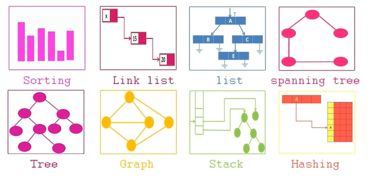
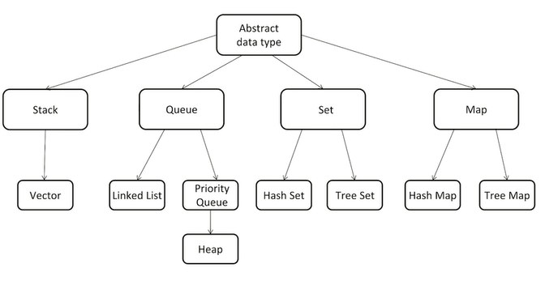
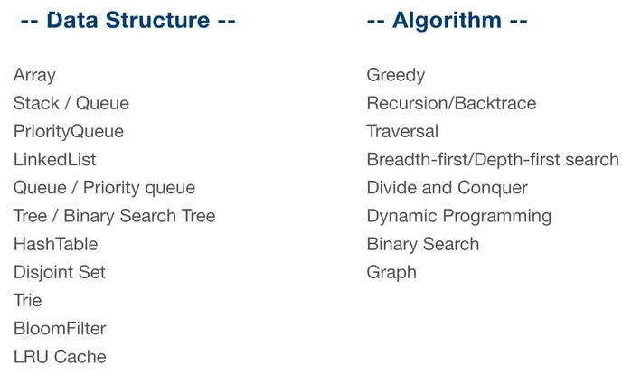

# 第二讲 如何有效学习算法和数据结构

> 《Outliers》 中文版译名：《异类-不一样的成功启示录》

## Chunk it up （切碎知识点）

## Deliberate practicing （刻意练习）

- 刻意练习

- 练习缺陷、弱点地方

- 不舒服、不爽、枯燥

## Feedback （反馈）

- 即时反馈

- 主动型反馈（自己去找）
  - 高手代码（GitHub、LeetCode）
  - 第一视角

- 被动式反馈（高手给你指点）
  - code review

## 面试切题四件套

- Clarification（明确题目意思）

- Possible solutions（把所有可能的解写出来）
  - compare （比较）
  - optimal （最优解）

- Coding（多写）

- Test cases（测试案例）