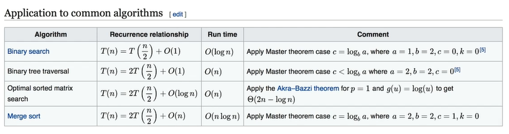

# 第三讲 如何计算算法复杂度

一个算法的优劣主要从算法的`空间复杂度`和`时间复杂度`来衡量

- 时间复杂度：评估执行程序所需的时间，可以估算出程序处理器的使用程度

- 空间复杂度：评估执行程序所需的存储空间，可以估算出程序对计算机内存的使用程度

## 时间复杂度

- O(1)：Constant Complexity：Constant 常数复杂度

```js
var n = 1
while (n < 10) {
  n++
}
```

- O(log n)：Logarithmic Complexity：对数复杂度

```js
for (var i = 1; i < n; i = i * 2) {
  console.log(i)
}
```

- O(n)：Linear Complexity：线性时间复杂度

```js
for (var i = 1; i <= n; i++) {
  console.log(n)
}
```

- O(n^2)：N square Complexity：平方阶

```js
for (var i = 1; i <= n; i++) {
  for (var j = 1; j <= n; j++) {
    console.log(object)
  }
}
```

- O(n^3)：N square Complexity：立方阶
- O(k^n)：Exponential Growth：指数

```js
for (var i = 1; i < Math.pow(2, n); i++) {
  console.log(i)
}
```

- O(n!)：Factorial：阶乘

```js
for (var i = 1; i < factorial(n); i++) {
  console.log(i)
}
```

注意：好几块代码合在一起时，只看最高复杂度的运算

主定理（master theorem）：


